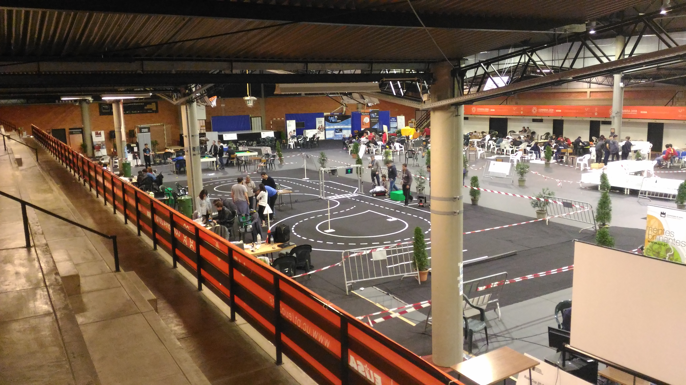

# [Autonomous Driving Simulator for the Portuguese Robotics Open](https://github.com/ee09115/conde_simulator)

[ROS Kinetic Support](https://github.com/ee09115/conde_simulator)

[ROS Indigo Support](https://bitbucket.org/ee09115/conde_simulator_student)

## Overview
The autonomous driving competition of the [Portuguese Robotics Open](http://robotica2017.isr.uc.pt/index.php/en/competitions/major/autonomous-driving) (PRO) represents a medium complexity technical challenge 
in which a mobile robot completely devoid of human input during its runtime travels in a track, Fig. 1, detects and identifies signalling panels 
projected in two ordinary monitors, recognizes traffic signs defined in the [competition ruling](http://robotica2017.isr.uc.pt/Rules2017/fnr2017_Autonomous_Driving.pdf) , detects and avoids obstacles and is able to park in two different parking areas.

The robot model represents a real robot presented in Fig.2. 
This robot uses a differential driving steering locomotion (two small wheels coupled in two motors that controls its linear and angular movement) and a castor wheel to balance the structure. 
The sensors applied to the robot are three cameras. Two pointed down to see/navigate along the track and detect/avoid obstacles and one pointed up to detect/identify the signaling panels and 
traffic signs. This simulator is able to replicate the autonomous driving competition challenges of the PRO except the tunnel and working zone.

* [Conference Paper](http://ieeexplore.ieee.org/document/7521461/)
* [Journal Article](https://www.igi-global.com/article/simulator-for-teaching-robotics-ros-and-autonomous-driving-in-a-competitive-mindset/186833)
* [Presentation Guidelines](https://github.com/ee09115/conde_simulator/blob/master/presentations/10%20-%20Conde%20Auton%20Drv%20Simul.pdf)

Fig. 1 - Driving Track for the 2017 Autonomous Driving Competition of the PRO.

Fig. 2 - Real Robot.

Fig. 3 - Simulation world with the robot.

Fig. 4 - Menu to choose the desired signalling panel.

## Instalation and Dependencies
* ROS distro: [ROS Kinetic](http://wiki.ros.org/kinetic/Installation/Ubuntu)

* Ubuntu version: Ubuntu 16.04 LTS

* Gazebo version: Gazebo 7.0

Perform the full instalation for the ROS Kinetic that comes with Gazebo 7.0

## Building
Clone this repository into the src folder inside the catkin workspace and compile it.

## Running 
To launch the simulation world for D1, D2 and D3 challenges run, Fig. 3:

	roslaunch conde_world spawn_world.launch
	
To spawn the robot inside the world run:

	roslaunch conde_world spawn_robot.launch
	
To spawn the obstacles in the world run one of the following commands:

	roslaunch conde_world spawn_obstacles_v1.launch
	
	roslaunch conde_world spawn_obstacles_v2.launch
	
For the bay parking challenge with obstacle run one of the following commands:

	roslaunch conde_world spawn_parking_obstacles_v1.launch
	
	roslaunch conde_world spawn_parking_obstacles_v2.launch
	
To spawn the traffic signs in the world run:

	roslaunch conde_world spawn_traffic_sign_panels.launch

Controlling the signalling panels run, Fig. 4:

	rosrun gazebo_semaphore gazebo_semaphore_node
	
Controlling the traffic signs run:

	rosrun gazebo_traffic_sign gazebo_traffic_sign_node

